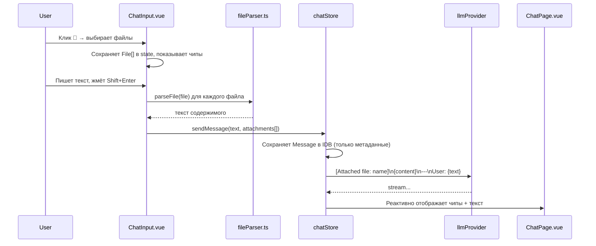

# План: прикрепление файлов к сообщениям

## Цель

Пользователь может прикрепить файлы к сообщению. Содержимое файла отправляется модели как контекст, но в UI отображается только чип с именем файла (не сырое содержимое).

---

## Архитектура

### UI-поток



### Модель Message

```typescript
// db.ts — добавка к Message
export interface AttachmentMeta {
  name: string;   // report.pdf
  type: string;   // application/pdf
  size: number;   // 128000
}

export interface Message {
  // ... существующие поля
  attachments?: AttachmentMeta[];  // NEW
}
```

### Как выглядит в UI

```
┌──────────────────────────────────────────┐
│ You                                       │
│ ┌──────────────────────────────────────┐  │
│ │ 📄 report.pdf  128 KB               │  │  ← чипы файлов
│ │ 📄 config.yaml  2 KB                │  │
│ ├──────────────────────────────────────┤  │
│ │ О чём этот документ?                │  │  ← текст сообщения
│ └──────────────────────────────────────┘  │
└──────────────────────────────────────────┘
```

### Как выглядит payload для LLM

```
[Attached file: report.pdf]
...содержимое PDF...

[Attached file: config.yaml]
...содержимое YAML...
---
User: О чём этот документ?
```

---

## fileParser.ts — новый сервис

```typescript
// src/services/fileParser.ts

// Все текстовые форматы — через readAsText, без библиотек
const TEXT_EXTENSIONS = new Set([
  'txt', 'yaml', 'yml', 'md', 'markdown', 'xml', 'json',
  'csv', 'tsv', 'toml', 'ini', 'cfg', 'log', 'env',
  // Код
  'js', 'ts', 'jsx', 'tsx', 'vue', 'py', 'java', 'c', 'cpp',
  'h', 'rs', 'go', 'rb', 'php', 'sql', 'sh', 'bash', 'zsh',
  'css', 'scss', 'less', 'html', 'htm', 'svg', 'graphql', 'proto',
]);

async function parseFile(file: File): Promise<string> {
  const ext = file.name.split('.').pop()?.toLowerCase();

  if (ext && TEXT_EXTENSIONS.has(ext)) {
    return readAsText(file);
  }
  if (ext === 'pdf') {
    return parsePdf(file);      // pdfjs-dist
  }
  if (ext === 'docx') {
    return parseDocx(file);     // mammoth.js
  }
  // Fallback: пробуем как текст
  return readAsText(file);
}
```

---

## Какой контент хранить в IndexedDB?

**Только метаданные** (`name`, `type`, `size`). Содержимое файлов НЕ хранится в IDB:
- Файлы могут быть большими (PDF на 10 MB)
- Хранить текст в IDB — денормализация и раздувание базы
- При `editMessage` файлы придётся прикреплять заново (приемлемо)

---

## План реализации

1. **[`package.json`](package.json)** — добавить `pdfjs-dist` и `mammoth`
2. **[`db.ts`](src/services/db.ts)** — `AttachmentMeta` интерфейс, поле `attachments` в `Message`
3. **[`fileParser.ts`](src/services/fileParser.ts)** — новый сервис, универсальный парсер
4. **[`chatStore.ts`](src/stores/chatStore.ts)** — `sendMessage` принимает `attachments`, строит payload с `[Attached file: ...]\n{content}`
5. **[`ChatInput.vue`](src/components/ChatInput.vue)** — кнопка 📎, `<input type="file" multiple hidden>`, чипы файлов, интеграция с `fileParser`
6. **[`ChatPage.vue`](src/pages/ChatPage.vue)** — отображение чипов в user-сообщениях
7. **[`app.scss`](src/css/app.scss)** — стили чипов файлов
