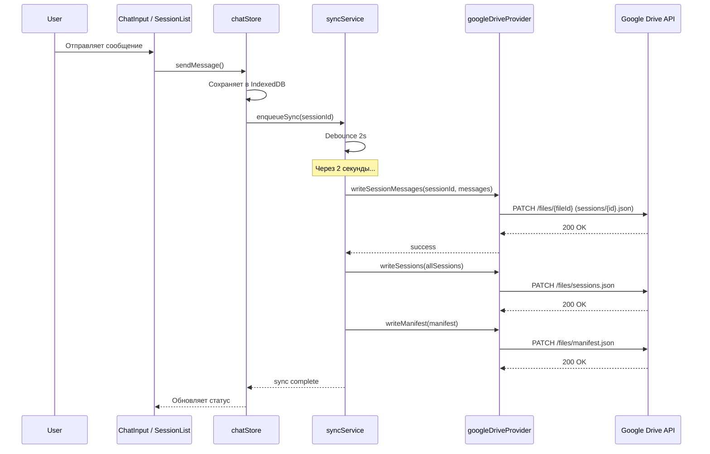

# Google Drive Sync — Архитектурный план

## 1. Обзор

Синхронизация данных чата через Google Drive с использованием **Google Identity Services (GIS)** для OAuth 2.0. Синхронизируются:
- **Сессии** (sessions) — список чатов с их метаданными
- **Сообщения** (messages) — все сообщения каждой сессии
- **User Facts** — факты о пользователе
- **Настройки чатов** — systemPrompt, summary, summaryEnabled (поля сессии)

Глобальные настройки API (endpoint, apiKey, model и т.д.) **НЕ синхронизируются** — они локальны для каждого устройства.

---

## 2. Структура в Google Drive

```
📁 OpenAI-Chat-Backup/          # Единая папка приложения
├── 📄 manifest.json            # Мета-информация о бэкапе
├── 📄 sessions.json            # Список всех сессий (без сообщений)
├── 📄 user-facts.json          # User Facts
└── 📁 sessions/                # Папка с сообщениями по сессиям
    ├── 📄 {sessionId}.json     # Сообщения одной сессии
    ├── 📄 {sessionId}.json
    └── ...
```

### manifest.json
```json
{
  "version": 1,
  "appVersion": "0.2.6",
  "lastSyncedAt": 1712345678901,
  "sessionsCount": 5,
  "totalMessages": 142
}
```

### sessions.json
```json
[
  {
    "id": "uuid-1",
    "title": "Chat about Vue",
    "createdAt": 1712345678000,
    "updatedAt": 1712345678901,
    "systemPrompt": "You are a helpful assistant...",
    "summary": "Conversation summary...",
    "summaryEnabled": true
  },
  ...
]
```

### user-facts.json
```json
{
  "facts": [
    "Работает с TypeScript + Vue 3",
    "Живёт в Москве"
  ],
  "updatedAt": 1712345678901
}
```

### sessions/{sessionId}.json
```json
{
  "sessionId": "uuid-1",
  "messages": [
    {
      "id": 1,
      "role": "user",
      "content": "Hello!",
      "reasoning": null,
      "searchMeta": null,
      "attachments": null,
      "createdAt": 1712345678000
    },
    {
      "id": 2,
      "role": "assistant",
      "content": "Hi! How can I help?",
      "reasoning": null,
      "searchMeta": null,
      "attachments": null,
      "createdAt": 1712345678100
    }
  ]
}
```

**Почему такая структура:**
- `sessions.json` — лёгкий, синхронизируется быстро, позволяет получить список чатов без загрузки всех сообщений
- Каждая сессия — отдельный файл: при изменении одной сессии не нужно перезаписывать гигантский JSON со всеми данными
- `user-facts.json` — отдельно, так как это глобальные данные, не привязанные к сессии
- `manifest.json` — позволяет быстро проверить, существует ли бэкап, и получить мета-информацию

---

## 3. Google Drive API Integration

### 3.1. Авторизация (Google Identity Services)

Используется **Google Identity Services (GIS)** с `tokenClient` (OAuth 2.0 implicit flow).

```typescript
// src/services/googleDriveProvider.ts

const CLIENT_ID = '...'; // Из Google Cloud Console
const SCOPES = 'https://www.googleapis.com/auth/drive.file';
const BACKUP_FOLDER_NAME = 'OpenAI-Chat-Backup';

interface GoogleDriveAuth {
  accessToken: string;
  expiresAt: number; // timestamp
}
```

**Поток авторизации:**
1. Пользователь нажимает «Sign in with Google» в интерфейсе
2. Открывается попап Google (GIS `requestAccessToken`)
3. После успеха — сохраняем `accessToken` и `expiresAt`
4. Токен хранится в `sessionStorage` (не в IndexedDB — это чувствительные данные)
5. При истечении — автоматический рефреш через GIS

### 3.2. API-методы

```typescript
// src/services/googleDriveProvider.ts

class GoogleDriveProvider {
  private auth: GoogleDriveAuth | null = null;

  // Авторизация
  async signIn(): Promise<void>  // GIS OAuth popup
  async signOut(): Promise<void> // Отзыв токена
  get isSignedIn(): boolean

  // Управление папкой бэкапа
  private async ensureBackupFolder(): Promise<string>  // Создать/найти папку
  private async findFile(folderId: string, fileName: string): Promise<string | null>  // ID файла или null

  // Чтение
  async readFile(fileName: string): Promise<string | null>  // Получить содержимое файла
  async readSessions(): Promise<Session[] | null>
  async readSessionMessages(sessionId: string): Promise<Message[] | null>
  async readUserFacts(): Promise<string[] | null>
  async readManifest(): Promise<Manifest | null>

  // Запись
  async writeFile(fileName: string, content: string): Promise<void>  // Создать или обновить файл
  async writeSessions(sessions: Session[]): Promise<void>
  async writeSessionMessages(sessionId: string, messages: Message[]): Promise<void>
  async writeUserFacts(facts: string[]): Promise<void>
  async writeManifest(manifest: Manifest): Promise<void>

  // Удаление
  async deleteSessionFile(sessionId: string): Promise<void>
}
```

### 3.3. Используемые Google Drive API endpoints

| Операция | HTTP |
|----------|------|
| Поиск папки/файла | `GET /drive/v3/files?q=name='...' and trashed=false` |
| Создание файла | `POST /drive/v3/files` (multipart) |
| Чтение файла | `GET /drive/v3/files/{fileId}?alt=media` |
| Обновление файла | `PATCH /drive/v3/files/{fileId}` (multipart) |
| Удаление файла | `DELETE /drive/v3/files/{fileId}` |

---

## 4. Sync Service

```typescript
// src/services/syncService.ts

class SyncService {
  private drive: GoogleDriveProvider;
  private chatStore: ReturnType<typeof useChatStore>;
  private settingsStore: ReturnType<typeof useSettingsStore>;

  // Состояние синхронизации
  isSyncing: Ref<boolean>;
  lastSyncAt: Ref<number | null>;
  syncError: Ref<string | null>;

  // Полная синхронизация: выгрузить всё локальное в Drive
  async pushAll(): Promise<void>

  // Полная синхронизация: загрузить всё из Drive в локальное
  // (с подтверждением пользователя — перезаписывает локальные данные)
  async pullAll(): Promise<void>

  // Инкрементальная синхронизация: только изменённые сессии
  async pushSession(sessionId: string): Promise<void>

  // Синхронизация user-facts
  async pushUserFacts(): Promise<void>

  // Проверка статуса: есть ли бэкап в Drive
  async checkBackupExists(): Promise<boolean>
}
```

### 4.1. Стратегия синхронизации

**Last-write-wins** — никаких сложных merge-стратегий. Кто последний синхронизировался — тот и прав.

**Триггеры push-синхронизации:**
- После отправки сообщения (`sendMessage`)
- После редактирования сообщения (`editMessage`)
- После переименования сессии (`renameSession`)
- После обновления system prompt (`updateSystemPrompt`)
- После изменения summary (`maybeSummarize`)
- После изменения user facts (`saveUserFacts`)
- После удаления сессии (`removeSession`)

**Pull-синхронизация:**
- Только по явному действию пользователя (кнопка «Sync from Drive»)
- Перед применением — диалог подтверждения: «Все локальные данные будут заменены данными из Google Drive. Продолжить?»

### 4.2. Оптимизация

Чтобы не дёргать Drive API на каждое сообщение (при стриминге сообщения добавляются по одному), используется **debounce**:

```typescript
// В chatStore — очередь на синхронизацию
const syncQueue = ref<Set<string>>(new Set()); // sessionId's to sync

function enqueueSync(sessionId: string) {
  syncQueue.value.add(sessionId);
  debouncedFlush();
}

const debouncedFlush = useDebounce(async () => {
  const ids = [...syncQueue.value];
  syncQueue.value.clear();
  await Promise.all(ids.map((id) => syncService.pushSession(id)));
  await syncService.pushAll(); // обновить sessions.json + manifest
}, 2000); // 2 секунды после последнего изменения
```

---

## 5. Интеграция с существующим кодом

### 5.1. Новые файлы

| Файл | Назначение |
|------|-----------|
| `src/services/googleDriveProvider.ts` | Google Drive API клиент (авторизация, CRUD) |
| `src/services/syncService.ts` | Оркестратор синхронизации |
| `src/components/SyncSettings.vue` | UI: кнопки входа в Google, Sync Now, Sync from Drive, статус |

### 5.2. Изменения в существующих файлах

#### `src/stores/settingsStore.ts`
Добавить поля:
```typescript
const googleDriveEnabled = ref(false);   // Включена ли синхронизация
const googleDriveEmail = ref('');        // Email для отображения (не токен!)
```

Методы:
```typescript
async function saveGoogleDriveEnabled(val: boolean) { ... }
async function saveGoogleDriveEmail(val: string) { ... }
```

#### `src/stores/chatStore.ts`
Добавить вызовы синхронизации в ключевые точки:
- `sendMessage()` → `enqueueSync(sessionId)` после сохранения сообщений
- `editMessage()` → `enqueueSync(sessionId)`
- `renameSession()` → `enqueueSync(sessionId)`
- `updateSystemPrompt()` → `enqueueSync(sessionId)`
- `removeSession()` → `syncService.pushAll()` (удалить файл сессии из Drive)
- `maybeSummarize()` → `enqueueSync(sessionId)` после обновления summary

#### `src/components/SettingsDialog.vue`
Добавить секцию «Google Drive Sync»:
- Кнопка «Sign in with Google» / «Sign out»
- Статус: «Signed in as user@gmail.com» / «Not signed in»
- Toggle «Auto Sync»
- Кнопка «Sync Now» (push)
- Кнопка «Sync from Drive» (pull) с подтверждением
- Статус последней синхронизации

#### `src/components/SessionList.vue`
Добавить индикатор синхронизации в футер (рядом с Settings / Dark Mode):
- Иконка облака: зелёная (синхронизировано), серая (не настроено), анимированная (в процессе)

### 5.3. Схема потока данных



---

## 6. Google Cloud Console — Настройки

Для работы потребуется:

1. Создать проект в [Google Cloud Console](https://console.cloud.google.com/)
2. Включить **Google Drive API**
3. Создать **OAuth 2.0 Client ID** (тип: Web application)
4. Добавить в `Authorized JavaScript origins`:
   - `http://localhost:8080` (dev)
   - `https://bobbjedi.github.io` (production — если задеплоено на GitHub Pages)
5. Полученный `Client ID` вставить в `googleDriveProvider.ts`

**Важно:** `Client ID` не является секретом для клиентского приложения — он публичный.

---

## 7. Безопасность

- **Access token** хранится только в `sessionStorage` — очищается при закрытии вкладки
- **Refresh token** не используется (GIS implicit flow даёт краткосрочный access token)
- При `signOut` — токен отзывается через GIS
- Google Drive API используется с scope `drive.file` — приложение видит только свои файлы
- API-ключи (DeepSeek, Tavily) **НЕ синхронизируются** — остаются локальными

---

## 8. UI/UX

### SyncSettings.vue (внутри SettingsDialog)

```
┌─────────────────────────────────────┐
│  Google Drive Sync                  │
│  ─────────────────────────────────  │
│                                     │
│  [Sign in with Google]              │
│                                     │
│  или (после входа):                 │
│                                     │
│  ✓ Signed in as user@gmail.com      │
│  [Sign Out]                         │
│                                     │
│  ◉ Auto Sync                        │
│                                     │
│  [Sync Now]  [Sync from Drive]      │
│                                     │
│  Last synced: 2 minutes ago         │
└─────────────────────────────────────┘
```

### Индикатор в SessionList

В футере сайдбара, рядом с Dark Mode:
```
🌤️ Synced 2m ago    (зелёный — всё ок)
⛅ Syncing...        (анимированный — процесс)
☁️ Not connected    (серый — не настроено)
```

---

## 9. Пошаговый план реализации

### Шаг 1: Google Cloud Console
- Создать проект
- Включить Drive API
- Создать OAuth Client ID
- Получить Client ID

### Шаг 2: `src/services/googleDriveProvider.ts`
- Реализовать класс `GoogleDriveProvider`
- GIS авторизация (signIn/signOut)
- CRUD операции с файлами Drive
- Поиск/создание папки бэкапа

### Шаг 3: `src/services/syncService.ts`
- Реализовать `SyncService`
- `pushAll()` — полная выгрузка
- `pullAll()` — полная загрузка
- `pushSession()` — инкрементальная выгрузка сессии
- Debounce-механизм

### Шаг 4: `src/stores/settingsStore.ts`
- Добавить поля `googleDriveEnabled`, `googleDriveEmail`
- Добавить методы `saveGoogleDriveEnabled`, `saveGoogleDriveEmail`

### Шаг 5: `src/stores/chatStore.ts`
- Добавить вызовы `enqueueSync()` в ключевые точки
- Импортировать и инициализировать `syncService`

### Шаг 6: `src/components/SyncSettings.vue`
- Создать компонент с UI синхронизации

### Шаг 7: `src/components/SettingsDialog.vue`
- Добавить секцию Google Drive Sync с `SyncSettings`

### Шаг 8: `src/components/SessionList.vue`
- Добавить индикатор статуса синхронизации в футер

### Шаг 9: Тестирование
- Проверить авторизацию
- Проверить push/pull
- Проверить инкрементальную синхронизацию
- Проверить удаление сессии
- Проверить поведение при отсутствии сети
