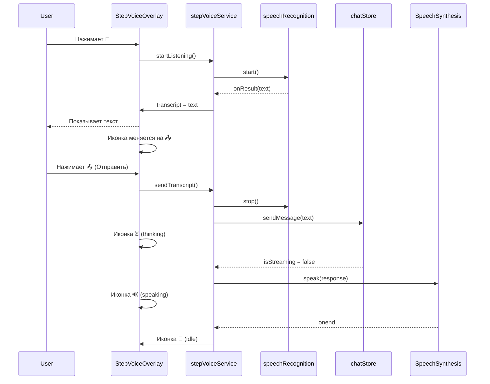

# Step-by-Step Voice Mode — план реализации

## Концепция

Полуавтоматический голосовой режим, который переиспользует уже работающий код:
- **Надиктовка** — из `ChatInput.vue` (`speechRecognition.start` + `startDictation`)
- **Отправка** — из `ChatInput.vue` (`submit()`)
- **Озвучивание ответа** — из `voiceModeService.ts` (`speakResponse`) и `MainLayout.vue` (`toggleTts`)

Никакого автоматического определения тишины, никаких таймеров. Только ручное управление: нажал — говорю — нажал отправить — жду ответ — ответ озвучивается — снова кнопка микрофона.

## Состояния

```
idle → listening → hasText → thinking → speaking → idle → ...
```

| Состояние | Иконка | Описание |
|-----------|--------|----------|
| `idle` | 🎤 mic | Ждёт нажатия пользователя |
| `listening` | 🔴 mic (пульсирует) | Микрофон слушает, пользователь говорит |
| `hasText` | 📤 send | Текст надиктован, кнопка «Отправить» |
| `thinking` | ⏳ hourglass | LLM думает |
| `speaking` | 🔊 volume_up | TTS озвучивает ответ |

## Архитектура

### Новый компонент: `StepVoiceOverlay.vue`

Полноэкранный оверлей (как текущий `VoiceModeOverlay`), но с упрощённым UI:

- Большая круглая кнопка по центру
- Меняет иконку в зависимости от состояния
- Транскрипт (текущий распознанный текст) — показывается всегда
- Кнопка закрытия (крестик или свайп вниз)

### Новый сервис: `stepVoiceService.ts`

Лёгкая обёртка, которая:
1. Использует `speechRecognition` из `speechRecognition.ts` (уже починен)
2. Использует `chatStore.sendMessage()` для отправки
3. Использует `window.speechSynthesis` для TTS (как `toggleTts` в MainLayout)

### Изменения в `MainLayout.vue`

- Добавить кнопку `🎤 Step Voice` в хедер (рядом с существующей `Voice Mode`)
- Подключить `StepVoiceOverlay`

### Изменения в `ChatInput.vue`

Не требуется — Step Voice Mode не трогает поле ввода. Он работает независимо.

## Поток данных



## Детальная реализация

### `src/services/stepVoiceService.ts`

```typescript
import { ref } from 'vue';
import { speechRecognition } from './speechRecognition';
import { useChatStore } from 'src/stores/chatStore';
import { useSettingsStore } from 'src/stores/settingsStore';

export type StepVoiceState = 'idle' | 'listening' | 'hasText' | 'thinking' | 'speaking';

export const stepVoiceState = {
  isActive: ref(false),
  state: ref<StepVoiceState>('idle'),
  transcript: ref(''),
};

let accumulatedText = '';

export const stepVoiceService = {
  start() {
    if (stepVoiceState.isActive.value) return;
    stepVoiceState.isActive.value = true;
    stepVoiceState.state.value = 'idle';
    stepVoiceState.transcript.value = '';
    accumulatedText = '';
  },

  stop() {
    speechRecognition.stop();
    stepVoiceState.isActive.value = false;
    stepVoiceState.state.value = 'idle';
    stepVoiceState.transcript.value = '';
    accumulatedText = '';
  },

  startListening() {
    accumulatedText = '';
    stepVoiceState.transcript.value = '';
    stepVoiceState.state.value = 'listening';

    speechRecognition.start({
      onResult(text: string) {
        accumulatedText = accumulatedText
          ? `${accumulatedText} ${text}`
          : text;
        stepVoiceState.transcript.value = accumulatedText;
        stepVoiceState.state.value = 'hasText';
      },
      onInterim(text: string) {
        stepVoiceState.transcript.value = accumulatedText
          ? `${accumulatedText} ${text}`
          : text;
      },
      onError() {
        stepVoiceState.state.value = 'idle';
      },
      onEnd(wasStopped: boolean) {
        // On mobile (continuous: false) — restart if still listening
        if (!wasStopped && stepVoiceState.state.value === 'listening') {
          speechRecognition.start({
            onResult(text: string) {
              accumulatedText = accumulatedText
                ? `${accumulatedText} ${text}`
                : text;
              stepVoiceState.transcript.value = accumulatedText;
              stepVoiceState.state.value = 'hasText';
            },
            onInterim(text: string) {
              stepVoiceState.transcript.value = accumulatedText
                ? `${accumulatedText} ${text}`
                : text;
            },
            onError() {
              stepVoiceState.state.value = 'idle';
            },
            onEnd(wasStopped2: boolean) {
              if (!wasStopped2 && stepVoiceState.state.value === 'listening') {
                stepVoiceService.startListening();
              }
            },
          });
        }
      },
    });
  },

  async send() {
    const text = accumulatedText.trim();
    if (!text) return;

    speechRecognition.stop();
    stepVoiceState.state.value = 'thinking';
    accumulatedText = '';

    const chatStore = useChatStore();
    const settings = useSettingsStore();
    await settings.load();

    if (!settings.apiKey) {
      stepVoiceState.state.value = 'idle';
      return;
    }

    // Auto-create session if needed
    if (!chatStore.currentSessionId) {
      await chatStore.createSession(text.slice(0, 50));
    }

    // Send message
    await chatStore.sendMessage(text);

    // Find last assistant response and speak it
    const msgs = chatStore.messages;
    let lastContent = '';
    for (let i = msgs.length - 1; i >= 0; i -= 1) {
      if (msgs[i].role === 'assistant' && msgs[i].content) {
        lastContent = msgs[i].content;
        break;
      }
    }

    if (lastContent) {
      stepVoiceState.state.value = 'speaking';
      await speakText(lastContent);
    }

    // Back to idle
    stepVoiceState.state.value = 'idle';
  },
};

async function speakText(text: string): Promise<void> {
  return new Promise((resolve) => {
    window.speechSynthesis.cancel();

    const cleanText = text
      .replace(/[#*_`[\]()>|~]/g, '')
      .replace(/\n{2,}/g, '. ')
      .replace(/\n/g, ' ')
      .trim();

    if (!cleanText) {
      resolve();
      return;
    }

    const settings = useSettingsStore();
    const utterance = new SpeechSynthesisUtterance(cleanText);
    utterance.lang = 'ru-RU';
    utterance.rate = settings.ttsRate;
    utterance.pitch = 1.0;

    utterance.onend = () => { resolve(); };
    utterance.onerror = () => { resolve(); };

    window.speechSynthesis.speak(utterance);
  });
}
```

### `src/components/StepVoiceOverlay.vue`

```vue
<template>
    <transition name="voice-fade">
        <div v-if="stepVoiceState.isActive.value" class="step-voice-overlay"
            @click.self="stepVoiceService.stop()">

            <!-- Центральная кнопка -->
            <div class="step-voice-center">
                <div class="step-voice-button"
                    :class="`step-voice-btn--${stepVoiceState.state.value}`"
                    @click="onButtonClick">

                    <!-- idle: большая кнопка микрофона -->
                    <template v-if="stepVoiceState.state.value === 'idle'">
                        <q-icon name="mic" size="64px" color="white" />
                    </template>

                    <!-- listening: пульсирующий микрофон -->
                    <template v-else-if="stepVoiceState.state.value === 'listening'">
                        <q-icon name="mic" size="64px" color="white" />
                    </template>

                    <!-- hasText: кнопка отправки -->
                    <template v-else-if="stepVoiceState.state.value === 'hasText'">
                        <q-icon name="send" size="64px" color="white" />
                    </template>

                    <!-- thinking: спиннер -->
                    <template v-else-if="stepVoiceState.state.value === 'thinking'">
                        <q-spinner size="64px" color="white" />
                    </template>

                    <!-- speaking: иконка звука -->
                    <template v-else-if="stepVoiceState.state.value === 'speaking'">
                        <q-icon name="volume_up" size="64px" color="white" />
                    </template>
                </div>

                <!-- Статус -->
                <div class="step-voice-label">{{ statusLabel }}</div>

                <!-- Транскрипт -->
                <div v-if="stepVoiceState.transcript.value" class="step-voice-transcript">
                    {{ stepVoiceState.transcript.value }}
                </div>
            </div>

            <!-- Кнопка закрытия -->
            <div class="step-voice-close" @click="stepVoiceService.stop()">
                <q-icon name="close" size="28px" color="grey-4" />
            </div>
        </div>
    </transition>
</template>

<script lang="ts">
import { defineComponent, computed } from 'vue';
import { stepVoiceState, stepVoiceService } from 'src/services/stepVoiceService';

export default defineComponent({
    name: 'StepVoiceOverlay',

    setup() {
        const statusLabel = computed(() => {
            switch (stepVoiceState.state.value) {
                case 'idle': return 'Tap to speak';
                case 'listening': return 'Listening...';
                case 'hasText': return 'Tap to send';
                case 'thinking': return 'Thinking...';
                case 'speaking': return 'Speaking...';
                default: return '';
            }
        });

        function onButtonClick() {
            switch (stepVoiceState.state.value) {
                case 'idle':
                    stepVoiceService.startListening();
                    break;
                case 'listening':
                    // Stop listening, keep accumulated text
                    speechRecognition.stop();
                    stepVoiceState.state.value = 'hasText';
                    break;
                case 'hasText':
                    stepVoiceService.send();
                    break;
                case 'thinking':
                case 'speaking':
                    // Do nothing
                    break;
            }
        }

        return {
            stepVoiceState,
            stepVoiceService,
            statusLabel,
            onButtonClick,
        };
    },
});
</script>

<style scoped>
.step-voice-overlay {
    position: fixed;
    top: 0;
    left: 0;
    right: 0;
    bottom: 0;
    z-index: 9999;
    display: flex;
    align-items: center;
    justify-content: center;
    background: rgba(10, 10, 15, 0.95);
    color: white;
}

.step-voice-center {
    display: flex;
    flex-direction: column;
    align-items: center;
    gap: 24px;
}

.step-voice-button {
    width: 140px;
    height: 140px;
    border-radius: 50%;
    display: flex;
    align-items: center;
    justify-content: center;
    cursor: pointer;
    transition: all 0.3s ease;
}

.step-voice-btn--idle {
    background: radial-gradient(circle at 35% 35%, rgba(59, 130, 246, 0.4), rgba(37, 99, 235, 0.6));
    box-shadow: 0 0 60px rgba(59, 130, 246, 0.3);
}

.step-voice-btn--idle:hover {
    transform: scale(1.05);
    box-shadow: 0 0 80px rgba(59, 130, 246, 0.5);
}

.step-voice-btn--listening {
    background: radial-gradient(circle at 35% 35%, rgba(239, 68, 68, 0.4), rgba(220, 38, 38, 0.6));
    box-shadow: 0 0 60px rgba(239, 68, 68, 0.3);
    animation: step-pulse-listening 1.5s ease-in-out infinite;
}

.step-voice-btn--hasText {
    background: radial-gradient(circle at 35% 35%, rgba(34, 197, 94, 0.4), rgba(22, 163, 74, 0.6));
    box-shadow: 0 0 60px rgba(34, 197, 94, 0.3);
}

.step-voice-btn--hasText:hover {
    transform: scale(1.05);
    box-shadow: 0 0 80px rgba(34, 197, 94, 0.5);
}

.step-voice-btn--thinking {
    background: radial-gradient(circle at 35% 35%, rgba(245, 158, 11, 0.4), rgba(217, 119, 6, 0.6));
    box-shadow: 0 0 60px rgba(245, 158, 11, 0.3);
}

.step-voice-btn--speaking {
    background: radial-gradient(circle at 35% 35%, rgba(34, 197, 94, 0.4), rgba(22, 163, 74, 0.6));
    box-shadow: 0 0 60px rgba(34, 197, 94, 0.3);
    animation: step-pulse-speaking 0.8s ease-in-out infinite;
}

@keyframes step-pulse-listening {
    0%, 100% { transform: scale(1); box-shadow: 0 0 60px rgba(239, 68, 68, 0.3); }
    50% { transform: scale(1.08); box-shadow: 0 0 90px rgba(239, 68, 68, 0.5); }
}

@keyframes step-pulse-speaking {
    0%, 100% { transform: scale(1); box-shadow: 0 0 60px rgba(34, 197, 94, 0.3); }
    50% { transform: scale(1.05); box-shadow: 0 0 80px rgba(34, 197, 94, 0.5); }
}

.step-voice-label {
    font-size: 15px;
    font-weight: 400;
    letter-spacing: 2px;
    text-transform: uppercase;
    color: rgba(255, 255, 255, 0.5);
}

.step-voice-transcript {
    font-size: 16px;
    color: rgba(255, 255, 255, 0.8);
    text-align: center;
    max-width: 80%;
    line-height: 1.5;
    padding: 12px 20px;
    background: rgba(255, 255, 255, 0.06);
    border: 1px solid rgba(255, 255, 255, 0.08);
    border-radius: 16px;
    min-height: 24px;
}

.step-voice-close {
    position: absolute;
    top: 20px;
    right: 20px;
    width: 44px;
    height: 44px;
    display: flex;
    align-items: center;
    justify-content: center;
    cursor: pointer;
    border-radius: 50%;
    background: rgba(255, 255, 255, 0.05);
    transition: background 0.2s;
}

.step-voice-close:hover {
    background: rgba(255, 255, 255, 0.1);
}

.voice-fade-enter-active,
.voice-fade-leave-active {
    transition: opacity 0.3s ease;
}

.voice-fade-enter-from,
.voice-fade-leave-to {
    opacity: 0;
}
</style>
```

### Изменения в `MainLayout.vue`

1. **Добавить кнопку в хедер** (рядом с существующей Voice Mode):
```vue
<q-btn flat dense round icon="record_voice_over"
    :color="stepVoiceState.isActive.value ? 'positive' : ''"
    @click="toggleStepVoice">
    <q-tooltip>Step Voice</q-tooltip>
</q-btn>
```

2. **Добавить `StepVoiceOverlay`** в шаблон:
```vue
<StepVoiceOverlay />
```

3. **Добавить `toggleStepVoice`** в `setup()`:
```typescript
function toggleStepVoice() {
    if (stepVoiceState.isActive.value) {
        stepVoiceService.stop();
    } else {
        stepVoiceService.start();
    }
}
```

4. **Импортировать** `stepVoiceService`, `stepVoiceState`, `StepVoiceOverlay`.

## Что НЕ нужно менять

- `ChatInput.vue` — не трогаем
- `voiceModeService.ts` — остаётся как есть (live-режим)
- `VoiceModeOverlay.vue` — остаётся как есть
- `speechRecognition.ts` — уже починен

## Файлы для создания

| Файл | Назначение |
|------|-----------|
| `src/services/stepVoiceService.ts` | Сервис с состояниями и логикой |
| `src/components/StepVoiceOverlay.vue` | Полноэкранный оверлей |

## Файлы для изменения

| Файл | Изменения |
|------|-----------|
| `src/layouts/MainLayout.vue` | Добавить кнопку в хедер, импорт, `StepVoiceOverlay` |

## Todo list для Code mode

1. Создать `src/services/stepVoiceService.ts`
2. Создать `src/components/StepVoiceOverlay.vue`
3. Обновить `src/layouts/MainLayout.vue` — кнопка + оверлей
4. Проверить сборку (`quasar build`)
