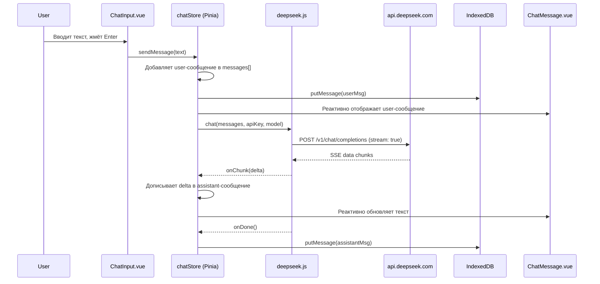

# Quasar DeepSeek Chat — План проекта

## Технологический стек

| Слой | Технология |
|------|-----------|
| Фреймворк | Quasar CLI (Vite, Vue 3, Composition API) |
| State | Pinia |
| Хранилище | IndexedDB (через idb) |
| API | Прямой fetch к `https://api.deepseek.com/v1` (OpenAI-совместимый формат) |
| Стриминг | SSE (Server-Sent Events) через ReadableStream |
| Рендеринг | q-markdown (или marked + DOMPurify) |
| Режим | Только SPA |

---

## Структура проекта

```
deepseek-chat/
├── quasar.config.js          # Конфигурация Quasar (SPA)
├── src/
│   ├── App.vue                # Корневой компонент
│   ├── layouts/
│   │   └── MainLayout.vue     # Основной макет (шапка + сайдбар)
│   ├── pages/
│   │   └── ChatPage.vue       # Страница чата
│   ├── components/
│   │   ├── ChatMessage.vue    # Одно сообщение (роль, контент, markdown)
│   │   ├── ChatInput.vue      # Поле ввода + кнопка отправки
│   │   ├── SessionList.vue    # Список сессий в сайдбаре
│   │   └── SettingsDialog.vue # Настройки: API-ключ, модель, эндпоинт
│   ├── stores/
│   │   ├── chatStore.js       # Pinia: сообщения, сессии, отправка
│   │   └── settingsStore.js   # Pinia: API-ключ, эндпоинт, модель
│   ├── services/
│   │   ├── deepseek.js        # API-клиент с SSE-стримингом
│   │   └── db.js              # IndexedDB-обёртка (idb library)
│   └── router/
│       └── routes.js          # Маршруты
```

---

## Схема IndexedDB

```
Database: deepseek-chat (version 1)

ObjectStore: sessions
  keyPath: id (string, uuid)
  indexes: updatedAt (timestamp)

ObjectStore: messages
  keyPath: id (autoIncrement)
  indexes: sessionId (string)

ObjectStore: settings
  keyPath: key (string)
```

---

## Поток данных



---

## API-клиент (deepseek.js)

- URL: `https://api.deepseek.com/v1/chat/completions`
- Метод: POST
- Заголовки: `Authorization: Bearer {apiKey}`, `Content-Type: application/json`
- Тело: `{ model, messages, stream: true }`
- Стриминг: `fetch` + `response.body.getReader()` + парсинг SSE (`data: {...}\n\n`)
- Поддержка `reasoning_content` (DeepSeek-R1)

---

## План реализации


4. Установить зависимости: `pinia`, `idb`, `marked`, `dompurify`, `uuid`
5. Создать [`services/db.js`](services/db.js) — IndexedDB-обёртка (sessions, messages, settings)
6. Создать [`services/deepseek.js`](services/deepseek.js) — API-клиент с SSE
7. Создать [`stores/settingsStore.js`](stores/settingsStore.js) — Pinia-хранилище настроек
8. Создать [`stores/chatStore.js`](stores/chatStore.js) — Pinia-хранилище чата
9. Создать [`components/ChatInput.vue`](components/ChatInput.vue)
10. Создать [`components/ChatMessage.vue`](components/ChatMessage.vue) (с markdown-рендерингом)
11. Создать [`components/SessionList.vue`](components/SessionList.vue)
12. Создать [`components/SettingsDialog.vue`](components/SettingsDialog.vue)
13. Создать [`pages/ChatPage.vue`](pages/ChatPage.vue) — собрать всё вместе
14. Создать [`layouts/MainLayout.vue`](layouts/MainLayout.vue)
15. Настроить [`quasar.config.js`](quasar.config.js) и маршрутизацию
16. Запустить и проверить
