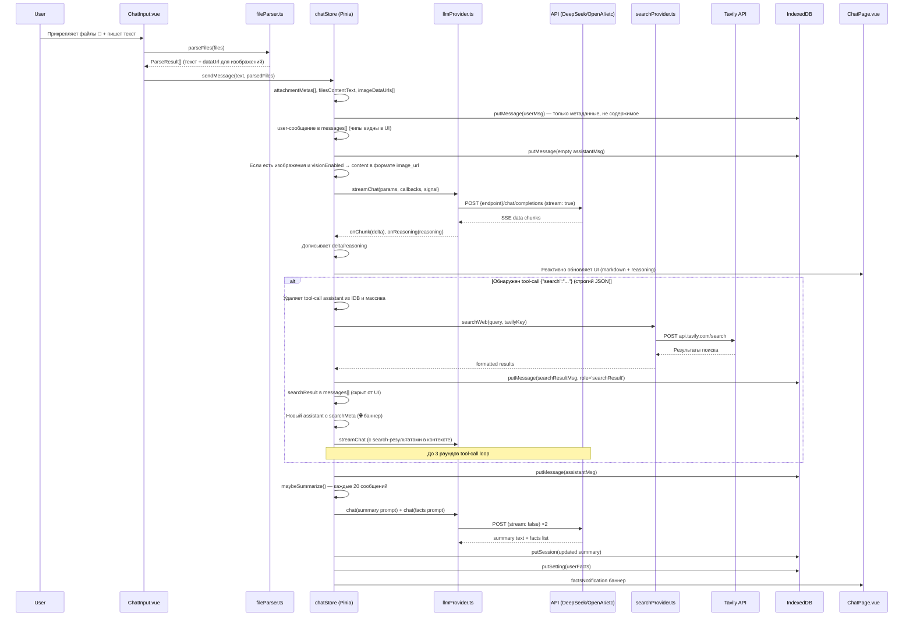

# OpenAI-Compatible Chat — Документация проекта

## Технологический стек

| Слой | Технология |
|------|-----------|
| Фреймворк | Quasar CLI (Webpack, Vue 3, Composition API, TypeScript) |
| State | Pinia |
| Хранилище | IndexedDB (через `idb`) |
| API | Универсальный OpenAI-совместимый клиент (DeepSeek, OpenAI, любые прокси) |
| Стриминг | SSE (Server-Sent Events) через `fetch` + `ReadableStream` |
| Рендеринг | `marked` + `DOMPurify` |
| Поиск | Tavily Search API (tool-call loop, до 3 раундов) |
| Парсинг файлов | `FileReader.readAsText` — все текстовые форматы без библиотек; изображения (PNG/JPEG/GIF/WebP) → base64 dataUrl для Vision API |
| Vision | Поддержка изображений через `content: [{ type: 'image_url', image_url: { url } }]` |
| Ввод | Голосовой ввод через Web Speech API |
| Генерация иконок | `sharp` — PWA-иконки из SVG |
| Режим | SPA + PWA |

---

## Структура проекта (актуальная)

```
openai-compatible-chat/
├── quasar.conf.js                    # Конфигурация Quasar (Webpack, SPA + PWA)
├── package.json                      # Зависимости и скрипты (v0.2.5)
├── tsconfig.json                     # TypeScript-конфиг
├── scripts/
│   └── generate-pwa-icons.mjs        # Генерация PWA-иконок из favicon.svg через sharp
├── src/
│   ├── App.vue                       # Корневой компонент (только <router-view>)
│   ├── layouts/
│   │   └── MainLayout.vue            # Шапка + сайдбар + ChatSettings + User Facts диалог
│   ├── pages/
│   │   ├── ChatPage.vue              # Страница чата (markdown, reasoning, файлы, поиск, facts)
│   │   ├── Error404.vue              # 404 страница
│   │   └── Index.vue                 # Заглушка (scaffold — можно удалить)
│   ├── components/
│   │   ├── ChatInput.vue             # Поле ввода + 📎 файлы (текст + изображения) + 🎤 голос + стоп
│   │   ├── SessionList.vue           # Список сессий + rename/delete + Settings + Dark Mode
│   │   ├── SettingsDialog.vue        # API: эндпоинт, ключ, модель, Vision, Tavily
│   │   ├── ChatSettingsDialog.vue    # Чат: system prompt, auto-summary, загрузка .txt
│   │   ├── CompositionComponent.vue  # Демо (scaffold — можно удалить)
│   │   ├── EssentialLink.vue         # Демо (scaffold — можно удалить)
│   │   └── models.ts                 # Демо-типы (scaffold — можно удалить)
│   ├── stores/
│   │   ├── chatStore.ts              # Сессии, сообщения, стриминг, summary, facts, tool-loop, vision
│   │   └── settingsStore.ts          # endpoint, apiKey, model, summaryModel, tokenLimit, vision, search, darkMode
│   ├── services/
│   │   ├── llmProvider.ts            # OpenAI-совместимый клиент (stream + non-stream, поддержка image_url)
│   │   ├── db.ts                     # IndexedDB (sessions, messages, settings)
│   │   ├── searchProvider.ts         # Tavily Search API-клиент
│   │   └── fileParser.ts             # Парсер файлов (текст через readAsText, изображения → base64)
│   ├── router/
│   │   ├── index.ts                  # Инициализация роутера
│   │   └── routes.ts                 # Маршруты (/ → ChatPage, 404)
│   ├── boot/
│   │   ├── pinia.ts                  # Инициализация Pinia
│   │   └── i18n.ts                   # Инициализация vue-i18n
│   ├── i18n/                         # Локализация (en-US)
│   ├── css/
│   │   ├── app.scss                  # ChatGPT-стиль: светлая/тёмная тема (~1070 строк)
│   │   └── quasar.variables.scss     # Переменные Quasar
│   └── assets/
├── src-pwa/                          # PWA: service worker, регистрация, манифест
├── plans/                            # Планы и архитектурные заметки
│   └── file-attachments.md           # УСТАРЕЛ — см. актуальный код fileParser.ts
└── public/                           # Статика: favicon, иконки PWA
    ├── favicon.svg
    ├── favicon.ico
    └── icons/                        # PWA-иконки всех размеров (генерируются скриптом)
```

---

## Схема IndexedDB

```
Database: deepseek-chat (version 2)

ObjectStore: sessions
  keyPath: id (string, uuid)
  indexes: updatedAt (timestamp)
  Поля: id, title, createdAt, updatedAt, systemPrompt?, summary?, summaryEnabled?

ObjectStore: messages
  keyPath: id (autoIncrement)
  indexes: sessionId (string)
  Поля: id?, sessionId, role (user|assistant|system|searchResult),
        content, reasoning?, searchMeta?, attachments?, createdAt

ObjectStore: settings
  keyPath: key (string)
  Поля: key, value
```

---

## Поток данных



---

## Роли сообщений

| Роль | Назначение | Видно в UI |
|------|-----------|------------|
| `user` | Сообщения пользователя | ✅ |
| `assistant` | Ответы модели | ✅ |
| `system` | System prompt (не сохраняется в messages) | ❌ |
| `searchResult` | Результаты поиска Tavily (только для LLM) | ❌ (скрыто) |

---

## API-клиент ([`src/services/llmProvider.ts`](src/services/llmProvider.ts))

### Типы

```typescript
type LlmContent = string | Array<
  | { type: 'text'; text: string }
  | { type: 'image_url'; image_url: { url: string } }
>;

interface LlmMessage {
  role: 'user' | 'assistant' | 'system';
  content: LlmContent;
}
```

### `streamChat(params, callbacks, signal?)`
- URL: `{endpoint}/chat/completions`
- Метод: POST
- Заголовки: `Authorization: Bearer {apiKey}`, `Content-Type: application/json`
- Тело: `{ model, messages, stream: true }`
- Стриминг: `fetch` + `response.body.getReader()` + парсинг SSE
- Поддержка `reasoning_content` (DeepSeek-R1)
- Поддержка `AbortController` (прерывание)
- Обработка `[DONE]`

### `chat(params, signal?)`
- Нестриминговая версия (summary, facts extraction)
- Возвращает `string`

---

## Search Provider ([`src/services/searchProvider.ts`](src/services/searchProvider.ts))

- **Tavily Search API**: `POST https://api.tavily.com/search`
- `searchWeb(query, apiKey)` — выполняет поиск
- `formatSearchResults(response)` — форматирует в текст для LLM
- Параметры: `search_depth: basic`, `include_answer: true`, `max_results: 5`

### Tool-call loop ([`src/stores/chatStore.ts`](src/stores/chatStore.ts))

1. Модель отвечает **строгим JSON** `{"search":"запрос"}` — без текста до/после
2. `detectToolCall()` валидирует через `JSON.parse`
3. Tool-call assistant **полностью удаляется** из IDB и массива
4. Создаётся `searchResult` сообщение (роль `searchResult`, скрыто в UI)
5. Создаётся новый assistant с `searchMeta` — отображается с 🌐 баннером
6. Модель получает результаты поиска в контексте и отвечает
7. Максимум 3 раунда

### Обязательные триггеры поиска
Ключевые слова: «новости», «news», «сейчас», «now», «сегодня», «today», «последние», «latest», «текущий год», «2025», «2026». Любой вопрос о погоде, датах, котировках, спорте, новостях.

Запрещено выдумывать — модель обязана искать через `{"search":"..."}`.

---

## File Parser ([`src/services/fileParser.ts`](src/services/fileParser.ts))

### Интерфейсы

```typescript
interface ParseResult {
  name: string;       // transactions.html
  text: string;       // содержимое файла (пусто для изображений)
  size: number;       // 1131
  dataUrl?: string;   // base64 data URL для изображений (PNG, JPEG, GIF, WebP)
}
```

### Поддерживаемые форматы
- **Текст**: любой файл читается как UTF-8 текст через `FileReader.readAsText()` — без фильтрации по расширениям или MIME-типам
- **Изображения**: PNG, JPEG, GIF, WebP — конвертируются в base64 dataUrl через `FileReader.readAsDataURL()`

### Как работает
- **В UI:** чипы `📄 filename — 128 KB` в ChatInput и в user-сообщениях; для изображений — превью
- **В IDB:** только метаданные (`name`, `type`, `size`), содержимое НЕ хранится
- **В LLM (текст):** содержимое вставляется в payload: `[Attached file: name]\n{content}\n\n---\nUser: {text}`
- **В LLM (изображения):** при `visionEnabled` → content форматируется как `[{ type: 'image_url', image_url: { url: dataUrl } }, { type: 'text', text: '...' }]`

---

## ChatInput ([`src/components/ChatInput.vue`](src/components/ChatInput.vue))

### Ввод
- Поле с авто-расширением (autogrow)
- **Десктоп:** Enter → отправка, Shift+Enter → перенос строки
- **Телефон:** Enter → перенос строки, отправка по кнопке ▶
- Определение мобильного через `navigator.userAgent`

### Прикрепление файлов 📎
- Скрытый `<input type="file" multiple>`
- Чипы файлов над полем ввода (можно удалить)
- Для изображений — миниатюра (через `URL.createObjectURL`)
- Парсинг через [`fileParser.ts`](src/services/fileParser.ts) перед отправкой

### Голосовой ввод 🎤
- Web Speech API (SpeechRecognition)
- Авто-определение языка (ru-RU / en-US)
- Только финальные результаты добавляются в поле
- Анимация пульсации при записи

### Действия
- Кнопка Stop при активном стриминге
- Отключение ввода во время стриминга

---

## Settings Store ([`src/stores/settingsStore.ts`](src/stores/settingsStore.ts))

| Поле | Тип | По умолчанию | Описание |
|------|-----|-------------|----------|
| `endpoint` | string | `https://api.deepseek.com/v1` | Базовый URL API |
| `apiKey` | string | `''` | API-ключ |
| `model` | string | `deepseek-chat` | Основная модель |
| `summaryModel` | string | `deepseek-chat` | Модель для summary |
| `tokenLimit` | number | `200000` | Лимит токенов контекста |
| `userFacts` | string[] | `[]` | Факты о пользователе (авто-извлечение) |
| `searchApiKey` | string | `''` | Tavily API-ключ |
| `searchEnabled` | boolean | `false` | Включен ли веб-поиск |
| `visionEnabled` | boolean | `false` | Включена ли поддержка изображений |
| `visionModel` | string | `deepseek-chat` | Модель для Vision API |
| `darkMode` | boolean | `false` | Тёмная тема (localStorage) |

---

## Chat Store ([`src/stores/chatStore.ts`](src/stores/chatStore.ts))

### Основные возможности
- **Управление сессиями**: создание, выбор, переименование, удаление
- **Прикрепление файлов**: `sendMessage(text, parsedFiles?)` — метаданные в IDB, содержимое в LLM
- **Vision (изображения)**: при `visionEnabled` → content в формате `image_url`, модель переключается на `visionModel`
- **SSE-стриминг**: с прерыванием через AbortController
- **Веб-поиск**: tool-call loop до 3 раундов, строгий JSON `{"search":"..."}`
- **Token budget**: `buildTrimmedMessages()` — обрезка истории с учётом system prompt, summary, user facts
- **Rolling Summary**: авто-суммаризация каждые 20 сообщений
- **User Facts**: авто-извлечение фактов о пользователе при summary (с дедупликацией и уведомлением об изменениях)
- **Редактирование сообщений**: `editMessage()` — переотправка с удалением последующих

### Ключевые функции
- `sendMessage(text, parsedFiles?)` — отправка с файлами, vision и tool-loop
- `editMessage(id, newText)` — редактирование и переотправка
- `cancelStream()` — прерывание через AbortController
- `maybeSummarize()` — авто-суммаризация + извлечение фактов (каждые 20 сообщений)
- `buildTrimmedMessages()` — обрезка истории под token budget (system → facts → summary → recent messages)
- `detectToolCall(text)` — поиск `{"search":"..."}` как чистого JSON
- `searchSystemPrompt()` — промпт с правилами tool-calling (текущая дата, обязательные триггеры)
- `streamWithToolLoop()` — стриминг с циклом обработки tool-call (до 3 раундов)

---

## ChatPage ([`src/pages/ChatPage.vue`](src/pages/ChatPage.vue))

### Рендеринг
- Markdown через `marked` + `DOMPurify` (XSS-безопасность)
- Reasoning-блоки (DeepSeek-R1): collapsible, авто-раскрытие при стриминге
- 🌐 Search meta баннер на assistant-сообщениях: «погода Москва — 5 result(s)»
- 📄 Чипы файлов в user-сообщениях (текст + изображения с иконками)
- User Facts баннер с просмотром и inline-редактированием
- Summary диалог (полноэкранный просмотр)
- Индикаторы: спиннер при стриминге, «Searching the web...» при поиске
- Умный авто-скролл: прокручивает вниз только если пользователь near bottom (< 100px)

### Действия с сообщениями
- Копирование текста (clipboard API)
- Редактирование user-сообщений (Ctrl+Enter)

### Welcome-экран
- Показывается при отсутствии сообщений
- Логотип — зелёная звезда на зелёном фоне

---

## SessionList ([`src/components/SessionList.vue`](src/components/SessionList.vue))

- Список сессий с подсветкой активной
- Контекстное меню: Rename / Delete
- Кнопка «New chat»
- Нижняя панель: Settings / Dark Mode toggle / версия приложения (из package.json)
- Адаптивное поведение: авто-закрытие сайдбара на мобильных

---

## Настройки API ([`src/components/SettingsDialog.vue`](src/components/SettingsDialog.vue))

- API Endpoint
- API Key (с переключением видимости)
- Model (выпадающий список + ручной ввод: `deepseek-v4-flash`, `deepseek-v4-pro`, `deepseek-chat`, `deepseek-reasoner`)
- Token Limit (1000–2 000 000)
- Summary Model
- **Image Support (Vision)**: toggle + Vision Model
- Web Search: toggle + Tavily API Key

---

## Настройки чата ([`src/components/ChatSettingsDialog.vue`](src/components/ChatSettingsDialog.vue))

- Auto Summary toggle
- System Prompt (textarea, до 10 000 символов)
- Загрузка system prompt из .txt файла

---

## Полный список возможностей

| Возможность | Реализация |
|-------------|-----------|
| SSE-стриминг с reasoning | [`src/services/llmProvider.ts`](src/services/llmProvider.ts) |
| Веб-поиск (Tavily) + tool-call loop (до 3 раундов) | [`src/services/searchProvider.ts`](src/services/searchProvider.ts) + [`src/stores/chatStore.ts`](src/stores/chatStore.ts) |
| Прикрепление файлов (все текстовые форматы) | [`src/services/fileParser.ts`](src/services/fileParser.ts) + [`src/components/ChatInput.vue`](src/components/ChatInput.vue) |
| Vision (изображения → base64 → image_url) | [`src/services/fileParser.ts`](src/services/fileParser.ts) + [`src/stores/chatStore.ts`](src/stores/chatStore.ts) |
| Голосовой ввод (SpeechRecognition) | [`src/components/ChatInput.vue`](src/components/ChatInput.vue) |
| Rolling Summary (каждые 20 сообщений) | [`src/stores/chatStore.ts`](src/stores/chatStore.ts) → `maybeSummarize()` |
| User Facts (авто-извлечение с дедупликацией) | [`src/stores/chatStore.ts`](src/stores/chatStore.ts) → facts extraction |
| Тёмная тема | [`src/stores/settingsStore.ts`](src/stores/settingsStore.ts) + [`src/css/app.scss`](src/css/app.scss) |
| Редактирование сообщений | [`src/stores/chatStore.ts`](src/stores/chatStore.ts) → `editMessage()` |
| Token budget management (system → facts → summary → messages) | [`src/stores/chatStore.ts`](src/stores/chatStore.ts) → `buildTrimmedMessages()` |
| Reasoning display (R1) | [`src/pages/ChatPage.vue`](src/pages/ChatPage.vue) — collapsible, авто-раскрытие |
| Адаптивный Enter (десктоп/телефон) | [`src/components/ChatInput.vue`](src/components/ChatInput.vue) → `onEnterKey()` |
| PWA поддержка | `src-pwa/` + [`quasar.conf.js`](quasar.conf.js) |
| i18n (базовая) | `src/i18n/` |
| Генерация PWA-иконок | [`scripts/generate-pwa-icons.mjs`](scripts/generate-pwa-icons.mjs) (sharp) |

---

## Зависимости ([`package.json`](package.json))

| Пакет | Версия | Назначение |
|-------|--------|-----------|
| `quasar` | 2.14.0 | UI-фреймворк |
| `vue` | ^3.0.0 | Реактивный фреймворк |
| `pinia` | 2 | State management |
| `idb` | ^8.0.3 | IndexedDB-обёртка |
| `marked` | 11 | Markdown-рендеринг |
| `dompurify` | ^3.4.5 | XSS-санитизация HTML |
| `vue-router` | ^4.0.0 | Маршрутизация |
| `vue-i18n` | ^9.0.0 | Локализация |
| `core-js` | ^3.6.5 | Полифилы |
| `@quasar/extras` | ^1.0.0 | Иконки и шрифты |
| `sass` | 1.77 | Препроцессор SCSS |
| `sharp` (dev) | ^0.34.5 | Генерация PWA-иконок из SVG |
| `workbox-webpack-plugin` (dev) | ^6.0.0 | PWA Service Worker |

---

## Конфигурация Quasar ([`quasar.conf.js`](quasar.conf.js))

- **Тип**: SPA (с PWA)
- **Роутер**: hash mode
- **Public Path**: `/openai-compatible-chat/`
- **Dev-сервер**: порт 8080, http
- **Boot**: `i18n`, `pinia`
- **Плагины**: `Dark`
- **PWA**: Workbox GenerateSW
- **CSS**: `app.scss`
- **Extras**: `roboto-font`, `material-icons`

---

## Файлы для удаления (scaffold)

| Файл | Причина |
|------|---------|
| [`src/components/CompositionComponent.vue`](src/components/CompositionComponent.vue) | Демо Quasar scaffold |
| [`src/components/EssentialLink.vue`](src/components/EssentialLink.vue) | Демо Quasar scaffold |
| [`src/components/models.ts`](src/components/models.ts) | Демо-типы (не используются) |
| [`src/pages/Index.vue`](src/pages/Index.vue) | Заглушка (не в роутах) |
