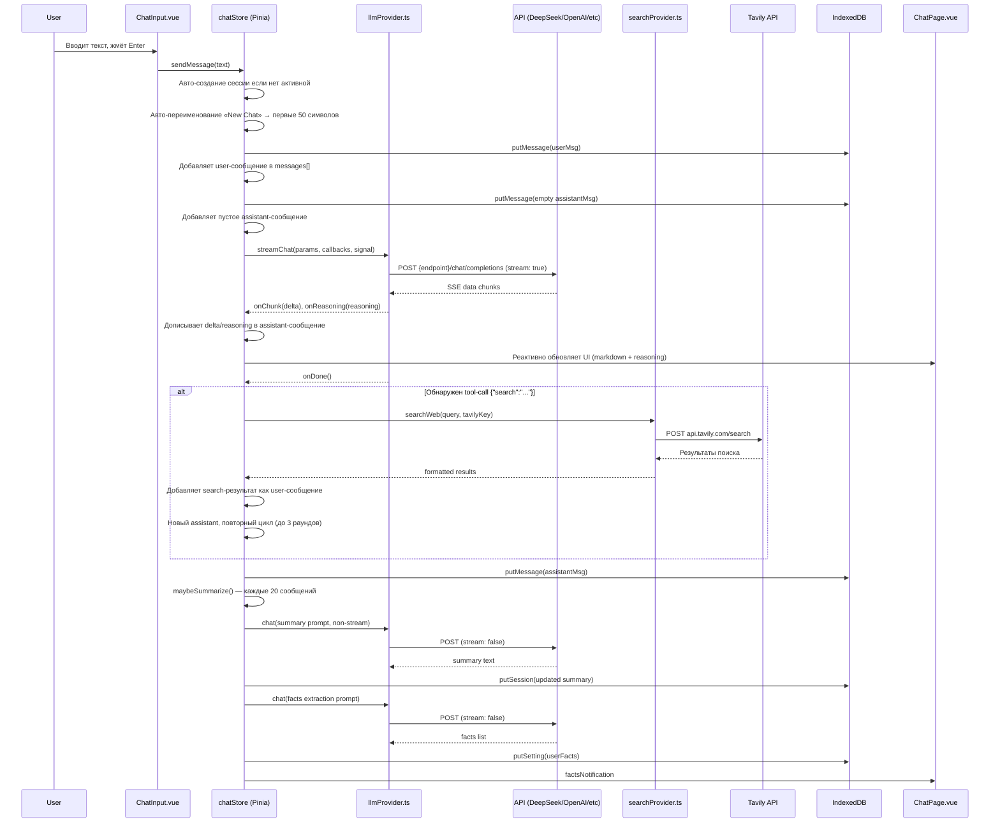

# OpenAI-Compatible Chat — Документация проекта

## Технологический стек

| Слой | Технология |
|------|-----------|
| Фреймворк | Quasar CLI (Webpack, Vue 3, Composition API, TypeScript) |
| State | Pinia |
| Хранилище | IndexedDB (через `idb`) |
| API | Универсальный OpenAI-совместимый клиент (DeepSeek, OpenAI, любые прокси) |
| Стриминг | SSE (Server-Sent Events) через `fetch` + `ReadableStream` |
| Рендеринг | `marked` + `DOMPurify` |
| Поиск | Tavily Search API |
| Режим | SPA + PWA |

---

## Структура проекта (актуальная)

```
openai-compatible-chat/
├── quasar.conf.js                 # Конфигурация Quasar (Webpack, SPA + PWA)
├── package.json                   # Зависимости и скрипты
├── tsconfig.json                  # TypeScript-конфиг
├── src/
│   ├── App.vue                    # Корневой компонент (только <router-view>)
│   ├── layouts/
│   │   └── MainLayout.vue         # Шапка + сайдбар (SessionList) + ChatSettingsDialog + User Facts
│   ├── pages/
│   │   ├── ChatPage.vue           # Страница чата (сообщения, markdown, reasoning, welcome)
│   │   ├── Error404.vue           # 404 страница
│   │   └── Index.vue              # Заглушка (scaffold)
│   ├── components/
│   │   ├── ChatInput.vue          # Поле ввода + голосовой ввод (SpeechRecognition) + стоп
│   │   ├── SessionList.vue        # Список сессий в сайдбаре + rename/delete
│   │   ├── SettingsDialog.vue     # Настройки API: эндпоинт, ключ, модель, Tavily
│   │   ├── ChatSettingsDialog.vue # Настройки чата: system prompt, auto-summary, загрузка из файла
│   │   ├── CompositionComponent.vue  # Демо-компонент (scaffold)
│   │   ├── EssentialLink.vue         # Демо-компонент (scaffold)
│   │   └── models.ts                 # Демо-типы Todo/Meta (scaffold)
│   ├── stores/
│   │   ├── chatStore.ts           # Pinia: сессии, сообщения, стриминг, summary, facts, tool-loop
│   │   └── settingsStore.ts       # Pinia: endpoint, apiKey, model, search, darkMode
│   ├── services/
│   │   ├── llmProvider.ts         # Универсальный OpenAI-совместимый клиент (stream + non-stream)
│   │   ├── db.ts                  # IndexedDB-обёртка (sessions, messages, settings)
│   │   └── searchProvider.ts      # Tavily Search API-клиент
│   ├── router/
│   │   ├── index.ts               # Инициализация роутера
│   │   └── routes.ts              # Маршруты (/ → ChatPage, 404)
│   ├── boot/
│   │   ├── pinia.ts               # Инициализация Pinia
│   │   └── i18n.ts                # Инициализация vue-i18n
│   ├── i18n/                      # Локализация (en-US)
│   ├── css/
│   │   ├── app.scss               # ChatGPT-стиль: светлая/тёмная тема (~980 строк)
│   │   └── quasar.variables.scss  # Переменные Quasar
│   └── assets/
│       └── quasar-logo-vertical.svg
├── src-pwa/                       # PWA: service worker, регистрация, манифест
└── public/                        # Статика: favicon, иконки PWA
```

---

## Схема IndexedDB

```
Database: deepseek-chat (version 2)

ObjectStore: sessions
  keyPath: id (string, uuid)
  indexes: updatedAt (timestamp)
  Поля: id, title, createdAt, updatedAt, systemPrompt?, summary?, summaryEnabled?

ObjectStore: messages
  keyPath: id (autoIncrement)
  indexes: sessionId (string)
  Поля: id?, sessionId, role, content, reasoning?, searchMeta?, createdAt

ObjectStore: settings
  keyPath: key (string)
  Поля: key, value
```

---

## Поток данных



---

## API-клиент ([`llmProvider.ts`](src/services/llmProvider.ts))

### `streamChat(params, callbacks, signal?)`
- URL: `{endpoint}/chat/completions` (гибкий эндпоинт, по умолчанию `https://api.deepseek.com/v1`)
- Метод: POST
- Заголовки: `Authorization: Bearer {apiKey}`, `Content-Type: application/json`
- Тело: `{ model, messages, stream: true }`
- Стриминг: `fetch` + `response.body.getReader()` + парсинг SSE (`data: {...}\n\n`)
- Поддержка `reasoning_content` (DeepSeek-R1 и аналоги)
- Поддержка `AbortController` (прерывание стрима)
- Обработка `[DONE]`

### `chat(params, signal?)`
- Нестриминговая версия (для авто-заголовков, summary, facts extraction)
- Возвращает `string`

---

## Search Provider ([`searchProvider.ts`](src/services/searchProvider.ts))

- **Tavily Search API**: `POST https://api.tavily.com/search`
- Функция `searchWeb(query, apiKey)` — выполняет поиск
- Функция `formatSearchResults(response)` — форматирует в читаемый текст для LLM
- Параметры: `search_depth: basic`, `include_answer: true`, `max_results: 5`

---

## Settings Store ([`settingsStore.ts`](src/stores/settingsStore.ts))

| Поле | Тип | По умолчанию | Описание |
|------|-----|-------------|----------|
| `endpoint` | string | `https://api.deepseek.com/v1` | Базовый URL API |
| `apiKey` | string | `''` | API-ключ |
| `model` | string | `deepseek-chat` | Основная модель |
| `summaryModel` | string | `deepseek-chat` | Модель для summary |
| `tokenLimit` | number | `200000` | Лимит токенов контекста |
| `userFacts` | string[] | `[]` | Факты о пользователе (авто-извлечение) |
| `searchApiKey` | string | `''` | Tavily API-ключ |
| `searchEnabled` | boolean | `false` | Включен ли веб-поиск |
| `darkMode` | boolean | `false` | Тёмная тема (localStorage) |

---

## Chat Store ([`chatStore.ts`](src/stores/chatStore.ts))

### Основные возможности
- **Управление сессиями**: создание, выбор, переименование, удаление
- **Отправка сообщений**: SSE-стриминг с прерыванием
- **Token budget**: обрезка старых сообщений при превышении лимита
- **Rolling Summary**: авто-суммаризация каждые 20 сообщений
- **User Facts**: авто-извлечение фактов о пользователе при summary
- **Web Search Tool Loop**: до 3 раундов tool-calling с Tavily
- **Редактирование сообщений**: переотправка с удалением последующих
- **System Prompt**: настраиваемый для каждой сессии

### Ключевые функции
- `sendMessage(text)` — отправка с авто-созданием сессии и tool-loop
- `editMessage(id, newText)` — редактирование и переотправка
- `cancelStream()` — прерывание через AbortController
- `maybeSummarize()` — авто-суммаризация + извлечение фактов
- `buildTrimmedMessages()` — обрезка истории под token budget

---

## ChatPage ([`ChatPage.vue`](src/pages/ChatPage.vue))

### Рендеринг
- Markdown через `marked` + `DOMPurify` (XSS-безопасность)
- Reasoning-блоки (DeepSeek-R1): collapsible, авто-раскрытие при стриминге
- User Facts баннер с просмотром и inline-редактированием
- Summary диалог (полноэкранный просмотр)
- Индикаторы: спиннер при стриминге, «Searching the web...» при поиске

### Действия с сообщениями
- Копирование текста (clipboard API)
- Редактирование user-сообщений (Ctrl+Enter для отправки)

### Welcome-экран
- Показывается при отсутствии сообщений и не в режиме стриминга

---

## SessionList ([`SessionList.vue`](src/components/SessionList.vue))

- Список сессий с подсветкой активной
- Контекстное меню: Rename / Delete
- Кнопка «New chat»
- Нижняя панель: Settings / Dark Mode toggle / версия приложения
- Адаптивное поведение: авто-закрытие сайдбара на мобильных

---

## ChatInput ([`ChatInput.vue`](src/components/ChatInput.vue))

- Поле ввода с авто-расширением (autogrow)
- Отправка по Enter
- Голосовой ввод через Web Speech API (SpeechRecognition)
  - Авто-определение языка (ru-RU / en-US) через `navigator.languages`
  - Только финальные результаты добавляются в поле
  - Анимация пульсации при записи
- Кнопка Stop при активном стриминге
- Отключение ввода во время стриминга

---

## Настройки API ([`SettingsDialog.vue`](src/components/SettingsDialog.vue))

- API Endpoint (с автодополнением известных моделей)
- API Key (с переключением видимости)
- Model (выпадающий список + ручной ввод: `deepseek-v4-flash`, `deepseek-v4-pro`, `deepseek-chat`, `deepseek-reasoner`)
- Token Limit (1000–2 000 000)
- Summary Model (отдельная модель для суммаризации)
- Web Search: toggle + Tavily API Key

---

## Настройки чата ([`ChatSettingsDialog.vue`](src/components/ChatSettingsDialog.vue))

- Auto Summary toggle (rolling summarization)
- System Prompt (textarea, до 10 000 символов)
- Загрузка system prompt из .txt файла

---

## Дополнительные возможности (сверх изначального плана)

| Возможность | Файл/Компонент |
|-------------|---------------|
| Веб-поиск через Tavily | [`searchProvider.ts`](src/services/searchProvider.ts) + tool-loop в [`chatStore.ts`](src/stores/chatStore.ts) |
| Rolling Summary (каждые 20 сообщений) | `maybeSummarize()` в [`chatStore.ts`](src/stores/chatStore.ts) |
| User Facts (авто-извлечение знаний о пользователе) | `maybeSummarize()` → facts extraction в [`chatStore.ts`](src/stores/chatStore.ts) |
| Голосовой ввод (SpeechRecognition) | [`ChatInput.vue`](src/components/ChatInput.vue) |
| Тёмная тема | `settingsStore.toggleDarkMode()` + [`app.scss`](src/css/app.scss) |
| Редактирование сообщений | `editMessage()` в [`chatStore.ts`](src/stores/chatStore.ts) |
| Token budget management | `buildTrimmedMessages()` в [`chatStore.ts`](src/stores/chatStore.ts) |
| Reasoning display (R1) | Collapsible блоки в [`ChatPage.vue`](src/pages/ChatPage.vue) |
| PWA поддержка | `src-pwa/` + конфиг в [`quasar.conf.js`](quasar.conf.js) |
| i18n (базовая) | `src/i18n/` |

---

## Зависимости ([`package.json`](package.json))

| Пакет | Версия | Назначение |
|-------|--------|-----------|
| `quasar` | ^2.14.0 | UI-фреймворк |
| `vue` | ^3.0.0 | Реактивный фреймворк |
| `pinia` | ^2 | State management |
| `idb` | ^8.0.3 | IndexedDB-обёртка |
| `marked` | ^11 | Markdown-рендеринг |
| `dompurify` | ^3.4.5 | XSS-санитизация HTML |
| `vue-router` | ^4.0.0 | Маршрутизация |
| `vue-i18n` | ^9.0.0 | Локализация |
| `core-js` | ^3.6.5 | Полифилы |
| `@quasar/extras` | ^1.0.0 | Иконки и шрифты |

---

## Конфигурация Quasar ([`quasar.conf.js`](quasar.conf.js))

- **Тип**: SPA (с PWA-конфигом)
- **Роутер**: hash mode
- **Public Path**: `/openai-compatible-chat/`
- **Dev-сервер**: порт 8080, авто-открытие браузера
- **Boot-файлы**: `i18n`, `pinia`
- **Плагины Quasar**: `Dark` (тёмная тема)
- **PWA**: Workbox GenerateSW, skipWaiting, clientsClaim
- **PWA Manifest**: имя «OpenAI-Compatible Chat», тема `#10a37f`

---

## Файлы, требующие удаления (scaffold/мусор)

| Файл | Причина |
|------|---------|
| [`src/components/CompositionComponent.vue`](src/components/CompositionComponent.vue) | Демо-компонент Quasar scaffold |
| [`src/components/EssentialLink.vue`](src/components/EssentialLink.vue) | Демо-компонент Quasar scaffold |
| [`src/components/models.ts`](src/components/models.ts) | Демо-типы (Todo, Meta), не используются |
| [`src/pages/Index.vue`](src/pages/Index.vue) | Заглушка, не используется в роутах |
