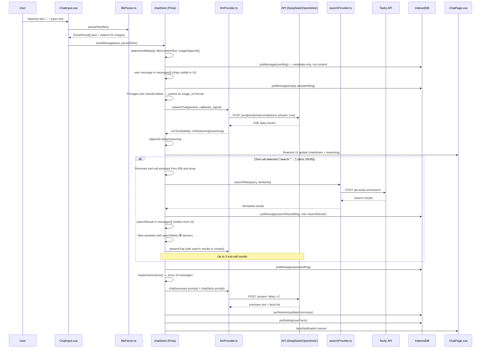

# OpenAI-Compatible Chat — Project Documentation

## Tech Stack

| Layer | Technology |
|------|-----------|
| Framework | Quasar CLI (Webpack, Vue 3, Composition API, TypeScript) |
| State | Pinia |
| Storage | IndexedDB (via `idb`) |
| API | Universal OpenAI-compatible client (DeepSeek, OpenAI, any proxy) |
| Streaming | SSE (Server-Sent Events) via `fetch` + `ReadableStream` |
| Rendering | `marked` + `DOMPurify` |
| Search | Tavily Search API (tool-call loop, up to 3 rounds) |
| File parsing | `FileReader.readAsText` — all text formats without libraries; images (PNG/JPEG/GIF/WebP) → base64 dataUrl for Vision API |
| Vision | Image support via `content: [{ type: 'image_url', image_url: { url } }]` |
| Voice Input | Web Speech API (dictation mode) |
| Voice Mode | Step-by-step manual mode (mic → send → streaming TTS) |
| TTS | SpeechSynthesis with streaming sentence-by-sentence playback |
| Icon generation | `sharp` — PWA icons from SVG |
| Mode | SPA + PWA |

---

## Project Structure (current)

```
openai-compatible-chat/
├── quasar.conf.js                    # Quasar config (Webpack, SPA + PWA, HTTPS dev)
├── package.json                      # Dependencies and scripts (v0.8.0)
├── tsconfig.json                     # TypeScript config
├── scripts/
│   └── generate-pwa-icons.mjs        # PWA icon generation from favicon.svg via sharp
├── src/
│   ├── App.vue                       # Root component (only <router-view>)
│   ├── layouts/
│   │   └── MainLayout.vue            # Header + sidebar + ChatSettings + User Facts + Voice overlays
│   ├── pages/
│   │   ├── ChatPage.vue              # Chat page (markdown, reasoning, files, search, facts)
│   │   ├── Error404.vue              # 404 page
│   │   └── Index.vue                 # Placeholder (scaffold — can be removed)
│   ├── components/
│   │   ├── ChatInput.vue             # Input field + 📎 files (text + images) + 🎤 voice dictation + stop
│   │   ├── SessionList.vue           # Session list + rename/delete + Settings + Dark Mode
│   │   ├── SettingsDialog.vue        # API: endpoint, key, model, Vision, Tavily
│   │   ├── ChatSettingsDialog.vue    # Chat: system prompt, auto-summary, .txt upload
│   │   ├── StepVoiceOverlay.vue      # Step-by-step voice mode overlay (mic → send → TTS)
│   │   ├── CompositionComponent.vue  # Demo (scaffold — can be removed)
│   │   ├── EssentialLink.vue         # Demo (scaffold — can be removed)
│   │   ├── SyncSettings.vue          # Google Drive sync settings
│   │   └── models.ts                 # Demo types (scaffold — can be removed)
│   ├── stores/
│   │   ├── chatStore.ts              # Sessions, messages, streaming, summary, facts, tool-loop, vision
│   │   └── settingsStore.ts          # endpoint, apiKey, model, summaryModel, tokenLimit, vision, search, darkMode, ttsRate, stepVoiceTimeout
│   ├── services/
│   │   ├── llmProvider.ts            # OpenAI-compatible client (stream + non-stream, image_url support)
│   │   ├── db.ts                     # IndexedDB (sessions, messages, settings)
│   │   ├── searchProvider.ts         # Tavily Search API client
│   │   ├── fileParser.ts             # File parser (text via readAsText, images → base64)
│   │   ├── speechRecognition.ts      # Web Speech API wrapper (continuous on desktop, non-continuous on mobile)
│   │   ├── stepVoiceService.ts       # Step-by-step voice mode service (states, streaming TTS queue)
│   │   ├── ttsSanitizer.ts           # TTS text sanitizer
│   │   ├── syncService.ts            # Google Drive sync service
│   │   └── googleDriveProvider.ts    # Google Drive API provider
│   ├── router/
│   │   ├── index.ts                  # Router initialization
│   │   └── routes.ts                 # Routes (/ → ChatPage, 404)
│   ├── boot/
│   │   ├── pinia.ts                  # Pinia initialization
│   │   └── i18n.ts                   # vue-i18n initialization
│   ├── i18n/                         # Localization (en-US)
│   ├── css/
│   │   ├── app.scss                  # ChatLLM style: light/dark theme (~1070 lines)
│   │   └── quasar.variables.scss     # Quasar variables
│   └── assets/
├── src-pwa/                          # PWA: service worker, registration, manifest
├── plans/                            # Plans and architecture notes
│   ├── file-attachments.md           # OUTDATED — see fileParser.ts
│   ├── google-drive-sync.md          # Google Drive sync plan
│   └── step-voice-mode.md            # Step Voice Mode plan
└── public/                           # Static: favicon, PWA icons
    ├── favicon.svg
    ├── favicon.ico
    ├── key.pem                       # HTTPS dev server key
    ├── cert.pem                      # HTTPS dev server cert
    └── icons/                        # PWA icons (generated by script)
```

---

## IndexedDB Schema

```
Database: deepseek-chat (version 2)

ObjectStore: sessions
  keyPath: id (string, uuid)
  indexes: updatedAt (timestamp)
  Fields: id, title, createdAt, updatedAt, systemPrompt?, summary?, summaryEnabled?

ObjectStore: messages
  keyPath: id (autoIncrement)
  indexes: sessionId (string)
  Fields: id?, sessionId, role (user|assistant|system|searchResult),
          content, reasoning?, searchMeta?, attachments?, createdAt

ObjectStore: settings
  keyPath: key (string)
  Fields: key, value
```

---

## Data Flow



---

## Message Roles

| Role | Purpose | Visible in UI |
|------|---------|---------------|
| `user` | User messages | ✅ |
| `assistant` | Model responses | ✅ |
| `system` | System prompt (not saved in messages) | ❌ |
| `searchResult` | Tavily search results (for LLM only) | ❌ (hidden) |

---

## API Client ([`src/services/llmProvider.ts`](src/services/llmProvider.ts))

### Types

```typescript
type LlmContent = string | Array<
  | { type: 'text'; text: string }
  | { type: 'image_url'; image_url: { url: string } }
>;

interface LlmMessage {
  role: 'user' | 'assistant' | 'system';
  content: LlmContent;
}
```

### `streamChat(params, callbacks, signal?)`
- URL: `{endpoint}/chat/completions`
- Method: POST
- Headers: `Authorization: Bearer {apiKey}`, `Content-Type: application/json`
- Body: `{ model, messages, stream: true }`
- Streaming: `fetch` + `response.body.getReader()` + SSE parsing
- Supports `reasoning_content` (DeepSeek-R1)
- Supports `AbortController` (cancellation)
- Handles `[DONE]`

### `chat(params, signal?)`
- Non-streaming version (summary, facts extraction)
- Returns `string`

---

## Search Provider ([`src/services/searchProvider.ts`](src/services/searchProvider.ts))

- **Tavily Search API**: `POST https://api.tavily.com/search`
- `searchWeb(query, apiKey)` — performs search
- `formatSearchResults(response)` — formats results as text for LLM
- Parameters: `search_depth: basic`, `include_answer: true`, `max_results: 5`

### Tool-call loop ([`src/stores/chatStore.ts`](src/stores/chatStore.ts))

1. Model responds with **strict JSON** `{"search":"query"}` — no text before/after
2. `detectToolCall()` validates via `JSON.parse`
3. Tool-call assistant is **completely removed** from IDB and array
4. `searchResult` message created (role `searchResult`, hidden in UI)
5. New assistant created with `searchMeta` — displayed with 🌐 banner
6. Model receives search results in context and responds
7. Maximum 3 rounds

### Mandatory search triggers
Keywords: «новости», «news», «сейчас», «now», «сегодня», «today», «последние», «latest», «текущий год», «2025», «2026». Any question about weather, dates, stock prices, sports, news.

No hallucination — model must search via `{"search":"..."}`.

---

## File Parser ([`src/services/fileParser.ts`](src/services/fileParser.ts))

### Interfaces

```typescript
interface ParseResult {
  name: string;       // transactions.html
  text: string;       // file content (empty for images)
  size: number;       // 1131
  dataUrl?: string;   // base64 data URL for images (PNG, JPEG, GIF, WebP)
}
```

### Supported formats
- **Text**: any file read as UTF-8 via `FileReader.readAsText()` — no extension or MIME filtering
- **Images**: PNG, JPEG, GIF, WebP — converted to base64 dataUrl via `FileReader.readAsDataURL()`

### How it works
- **In UI:** chips `📄 filename — 128 KB` in ChatInput and user messages; image previews
- **In IDB:** metadata only (`name`, `type`, `size`), content NOT stored
- **In LLM (text):** content inserted into payload: `[Attached file: name]\n{content}\n\n---\nUser: {text}`
- **In LLM (images):** when `visionEnabled` → content formatted as `[{ type: 'image_url', image_url: { url: dataUrl } }, { type: 'text', text: '...' }]`

---

## ChatInput ([`src/components/ChatInput.vue`](src/components/ChatInput.vue))

### Input
- Autogrow textarea
- **Desktop:** Enter → send, Shift+Enter → new line
- **Mobile:** Enter → new line, send via ▶ button
- Mobile detection via `navigator.userAgent`

### File attachment 📎
- Hidden `<input type="file" multiple>`
- File chips above input (removable)
- Image thumbnails via `URL.createObjectURL`
- Parsing via [`fileParser.ts`](src/services/fileParser.ts) before send

### Voice dictation 🎤
- Web Speech API (SpeechRecognition)
- Auto language detection (ru-RU / en-US)
- Final results appended to input field
- Continuous restart via onEnd for dictation mode

### Actions
- Stop button during streaming
- Input disabled during streaming

---

## Settings Store ([`src/stores/settingsStore.ts`](src/stores/settingsStore.ts))

| Field | Type | Default | Description |
|-------|------|---------|-------------|
| `endpoint` | string | `https://api.deepseek.com/v1` | API base URL |
| `apiKey` | string | `''` | API key |
| `model` | string | `deepseek-chat` | Main model |
| `summaryModel` | string | `deepseek-chat` | Summary model |
| `tokenLimit` | number | `200000` | Context token limit |
| `userFacts` | string[] | `[]` | User facts (auto-extracted) |
| `searchApiKey` | string | `''` | Tavily API key |
| `searchEnabled` | boolean | `false` | Web search enabled |
| `visionEnabled` | boolean | `false` | Image support enabled |
| `visionModel` | string | `deepseek-chat` | Vision model |
| `darkMode` | boolean | `false` | Dark theme (localStorage) |
| `googleDriveEnabled` | boolean | `false` | Google Drive sync enabled |
| `googleDriveEmail` | string | `''` | Google Drive account email |
| `ttsRate` | number | `1.0` | TTS speech rate |
| `stepVoiceTimeout` | number | `3000` | Step voice auto-send timeout (ms, 0 = off) |

---

## Chat Store ([`src/stores/chatStore.ts`](src/stores/chatStore.ts))

### Key features
- **Session management**: create, select, rename, delete
- **File attachment**: `sendMessage(text, parsedFiles?)` — metadata in IDB, content in LLM
- **Vision (images)**: when `visionEnabled` → content as `image_url`, model switches to `visionModel`
- **SSE streaming**: with AbortController cancellation
- **Web search**: tool-call loop up to 3 rounds, strict JSON `{"search":"..."}`
- **Token budget**: `buildTrimmedMessages()` — history trimming with system prompt, summary, user facts
- **Rolling Summary**: auto-summarization every 20 messages
- **User Facts**: auto-extraction during summary (dedup + change notification)
- **Message editing**: `editMessage()` — resend with subsequent messages removed

### Key functions
- `sendMessage(text, parsedFiles?)` — send with files, vision, tool-loop
- `editMessage(id, newText)` — edit and resend
- `cancelStream()` — abort via AbortController
- `maybeSummarize()` — auto-summary + facts extraction (every 20 messages)
- `buildTrimmedMessages()` — trim history to token budget (system → facts → summary → recent messages)
- `detectToolCall(text)` — detect `{"search":"..."}` as pure JSON
- `searchSystemPrompt()` — tool-calling rules prompt (current date, mandatory triggers)
- `streamWithToolLoop()` — streaming with tool-call loop (up to 3 rounds)

---

## Step Voice Mode ([`src/services/stepVoiceService.ts`](src/services/stepVoiceService.ts) + [`src/components/StepVoiceOverlay.vue`](src/components/StepVoiceOverlay.vue))

### States
```
idle → listening → thinking → speaking → idle → ...
```

| State | Icon | Description |
|-------|------|-------------|
| `idle` | 🎤 mic | Waiting for user tap |
| `listening` | 🔴 mic / 📤 send | Microphone active, text accumulating |
| `thinking` | ⏳ spinner | LLM generating response |
| `speaking` | ⏹ stop | TTS speaking, tap to stop |

### Flow
1. User taps mic → microphone starts listening
2. Speech recognition accumulates text (interim + final results)
3. User taps send (or auto-send fires after timeout) → message sent to LLM
4. LLM response streams in — sentences are parsed and queued
5. TTS speaks sentences one by one as they arrive
6. When streaming ends and queue is empty → back to idle

### Streaming TTS
- Sentences are detected by `. ! ? \n` delimiters
- Incomplete fragments are buffered until a complete sentence is formed
- TTS queue processes sentences sequentially
- User can tap stop to cancel TTS and clear queue

### Auto-send
- Configurable timeout (0-10s, toggle on/off)
- Timer resets on each new speech fragment (interim and final)
- When timer fires → auto-send accumulated text

### Controls
- **AutoSend** — timeout toggle + value adjustment
- **Speed** — TTS speech rate (30%–200%)

---

## ChatPage ([`src/pages/ChatPage.vue`](src/pages/ChatPage.vue))

### Rendering
- Markdown via `marked` + `DOMPurify` (XSS-safe)
- Reasoning blocks (DeepSeek-R1): collapsible, auto-expand during streaming
- 🌐 Search meta banner on assistant messages
- 📄 File chips in user messages (text + images with icons)
- User Facts banner with view and inline editing
- Summary dialog (fullscreen)
- Indicators: spinner during streaming, "Searching the web..." during search
- Smart auto-scroll: scrolls down only if user is near bottom (< 100px)

### Message actions
- Copy text (clipboard API)
- Edit user messages (Ctrl+Enter)

### Welcome screen
- Shown when no messages
- Logo: green star on green background

---

## SessionList ([`src/components/SessionList.vue`](src/components/SessionList.vue))

- Session list with active highlight
- Context menu: Rename / Delete
- "New chat" button
- Bottom panel: Settings / Dark Mode toggle / app version (from package.json)
- Responsive: auto-close sidebar on mobile

---

## API Settings ([`src/components/SettingsDialog.vue`](src/components/SettingsDialog.vue))

- API Endpoint
- API Key (with visibility toggle)
- Model (dropdown + manual input: `deepseek-v4-flash`, `deepseek-v4-pro`, `deepseek-chat`, `deepseek-reasoner`)
- Token Limit (1000–2,000,000)
- Summary Model
- **Image Support (Vision)**: toggle + Vision Model
- Web Search: toggle + Tavily API Key

---

## Chat Settings ([`src/components/ChatSettingsDialog.vue`](src/components/ChatSettingsDialog.vue))

- Auto Summary toggle
- System Prompt (textarea, up to 10,000 chars)
- Load system prompt from .txt file

---

## Full Feature List

| Feature | Implementation |
|---------|---------------|
| SSE streaming with reasoning | [`src/services/llmProvider.ts`](src/services/llmProvider.ts) |
| Web search (Tavily) + tool-call loop (up to 3 rounds) | [`src/services/searchProvider.ts`](src/services/searchProvider.ts) + [`src/stores/chatStore.ts`](src/stores/chatStore.ts) |
| File attachment (all text formats) | [`src/services/fileParser.ts`](src/services/fileParser.ts) + [`src/components/ChatInput.vue`](src/components/ChatInput.vue) |
| Vision (images → base64 → image_url) | [`src/services/fileParser.ts`](src/services/fileParser.ts) + [`src/stores/chatStore.ts`](src/stores/chatStore.ts) |
| Voice dictation (SpeechRecognition) | [`src/components/ChatInput.vue`](src/components/ChatInput.vue) |
| Step Voice Mode (manual mic → send → streaming TTS) | [`src/services/stepVoiceService.ts`](src/services/stepVoiceService.ts) + [`src/components/StepVoiceOverlay.vue`](src/components/StepVoiceOverlay.vue) |
| Streaming TTS (sentence-by-sentence) | [`src/services/stepVoiceService.ts`](src/services/stepVoiceService.ts) → `processQueue()` |
| Rolling Summary (every 20 messages) | [`src/stores/chatStore.ts`](src/stores/chatStore.ts) → `maybeSummarize()` |
| User Facts (auto-extraction with dedup) | [`src/stores/chatStore.ts`](src/stores/chatStore.ts) → facts extraction |
| Dark theme | [`src/stores/settingsStore.ts`](src/stores/settingsStore.ts) + [`src/css/app.scss`](src/css/app.scss) |
| Message editing | [`src/stores/chatStore.ts`](src/stores/chatStore.ts) → `editMessage()` |
| Token budget management (system → facts → summary → messages) | [`src/stores/chatStore.ts`](src/stores/chatStore.ts) → `buildTrimmedMessages()` |
| Reasoning display (R1) | [`src/pages/ChatPage.vue`](src/pages/ChatPage.vue) — collapsible, auto-expand |
| Adaptive Enter (desktop/mobile) | [`src/components/ChatInput.vue`](src/components/ChatInput.vue) → `onEnterKey()` |
| PWA support | `src-pwa/` + [`quasar.conf.js`](quasar.conf.js) |
| i18n (basic) | `src/i18n/` |
| PWA icon generation | [`scripts/generate-pwa-icons.mjs`](scripts/generate-pwa-icons.mjs) (sharp) |
| Google Drive sync | [`src/services/syncService.ts`](src/services/syncService.ts) + [`src/services/googleDriveProvider.ts`](src/services/googleDriveProvider.ts) |

---

## Dependencies ([`package.json`](package.json))

| Package | Version | Purpose |
|---------|---------|---------|
| `quasar` | 2.14.0 | UI framework |
| `vue` | ^3.0.0 | Reactive framework |
| `pinia` | 2 | State management |
| `idb` | ^8.0.3 | IndexedDB wrapper |
| `marked` | 11 | Markdown rendering |
| `dompurify` | ^3.4.5 | XSS sanitization |
| `vue-router` | ^4.0.0 | Routing |
| `vue-i18n` | ^9.0.0 | Localization |
| `core-js` | ^3.6.5 | Polyfills |
| `@quasar/extras` | ^1.0.0 | Icons and fonts |
| `sass` | 1.77 | SCSS preprocessor |
| `sharp` (dev) | ^0.34.5 | PWA icon generation from SVG |
| `workbox-webpack-plugin` (dev) | ^6.0.0 | PWA Service Worker |

---

## Quasar Config ([`quasar.conf.js`](quasar.conf.js))

- **Type**: SPA (with PWA)
- **Router**: hash mode
- **Public Path**: `/openai-compatible-chat/`
- **Dev server**: port 8080, HTTPS (self-signed certs)
- **Boot**: `i18n`, `pinia`
- **Plugins**: `Dark`
- **PWA**: Workbox GenerateSW
- **CSS**: `app.scss`
- **Extras**: `roboto-font`, `material-icons`

---

## Files to Remove (scaffold)

| File | Reason |
|------|--------|
| [`src/components/CompositionComponent.vue`](src/components/CompositionComponent.vue) | Quasar scaffold demo |
| [`src/components/EssentialLink.vue`](src/components/EssentialLink.vue) | Quasar scaffold demo |
| [`src/components/models.ts`](src/components/models.ts) | Demo types (unused) |
| [`src/pages/Index.vue`](src/pages/Index.vue) | Placeholder (not in routes) |
